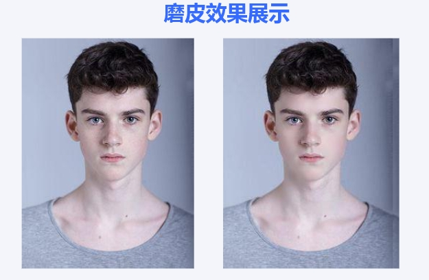
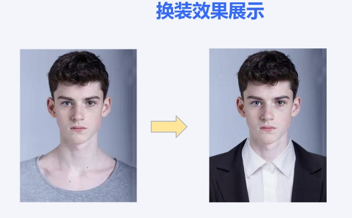

智能证件照
==========

该项目基于北邮程序设计实验课程要求开发

概述
--------

为了满足用户足不出户便可生成各种尺寸和背景颜色证件照的需求,我们将搭建一个智能证件照生成系统，用户将可以选择一张自己的生活照片，就可在系统中选择所需的证件照尺寸和背景颜色，系统还将实现人像美颜、服装更换等等功能，用户通过该智能证件照生成系统，就可得到符合要求的证件照片，系统提供用户预览和下载的功能。支持的图片格式包括png、jpg、bmp等常见格式，以满足用户不同设备的需求。

依赖项
------------

- 所有代码均用 Python 3 编写。
-  主要库:
  - •	PyQt5: 用于前端界面开发。
  - •	OpenCV: 用于图像处理。
  - • NumPy: 用于数值计算。
  - • PIL/Pillow: 用于图像操作。
  - •	Dlib: 用于人脸检测。
  - • mediapipe:用于识别眼睛

文件描述
--------------------

非 Python 文件：

文件名                         |  描述
----------------------------------|------------------------------------------------------------------------------------
README.md                         |  项目的文本文件（markdown 格式）描述。
shape_predictor_68_face_landmarks.dat             |  人像分割模型训练数据集
u2net.pth           |  训练好的模型
shape_predictor_68_face_landmarks.dat             |  人像分割模型训练数据集
balance.txt          |  用户余额储存
permanent_log.txt          |  用来记录刚登陆的用户，以便于在主页面显示
registered_users.txt          |  用来记录注册用户的用户名，密码以及头像
haarcascade_frontalface_default.xml        |  美白时人像检测

Python 脚本文件：

文件名                       |  描述
----------------------------------|------------------------------------------------------------------------------------
login.py            |  完成用户的注册和登录
mainform.py           |  程序主界面和一些人像处理函数
mainform.py          |  完成图像裁剪与背景更换的传参与流程
u2net.py              |  人像分割模型训练
data_loader.py              |  模型训练的数据集加载
my_u2net_test.py          |  调用生成的模型进行分割
to_background.py                |  背景的更换
to_standard_trimap.py            |  人像分割图的生成
web.py           |  网站部署
web_main.py           |  网站部署
upload.py           |  网站部署加载图片
ai_crop.py          |  裁剪图片
face_marks.py          |  探测人脸以及关键点
face_detect.py         |  人脸检测
ellipse_skin_model.py        |  皮肤检测
beauty.py        |  包含磨皮，大眼的美化函数

如何正确完整运行该程序
------------------------
首先运行login.py文件进行用户的注册与登录，进入程序主界面后，依次完成上传图片、背景颜色与尺寸的选择、美颜效果和换装的选择性使用，最后完成图片的下载（请尽量根据操作步骤完成，否则有可能会出现错误，图像处理时间较长请等待预览图出现再进行下一步操作）  
还需要注意必须先再用户中心完成充值才能进行图片的下载，每次下载消耗10余额。在用户中心还可以完成密码和头像的修改。

效果演示图
------------------------

图片
------------------------
库中的face_picture中有很多可尝试的人像图(侵删)

项目待拓展
------------------------
1.更多的美颜功能  
2.网页部署上线

人脸数据集和训练好的模型
------------------------

链接：https://pan.baidu.com/s/1MG8IFymIweS1KsmN-hSk3g?pwd=39pq 
提取码：39pq
